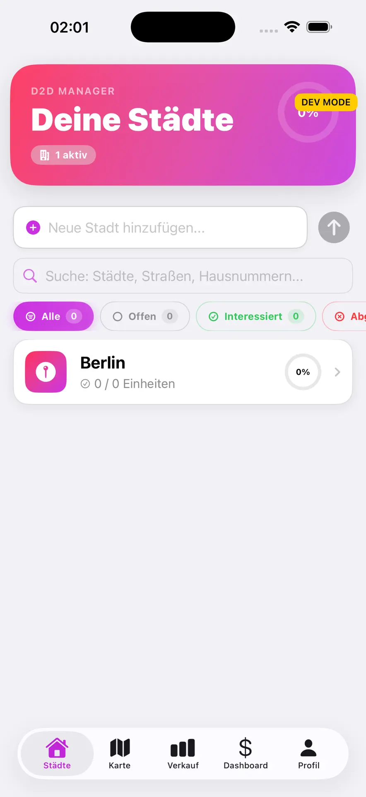
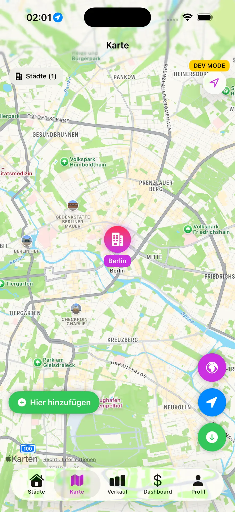
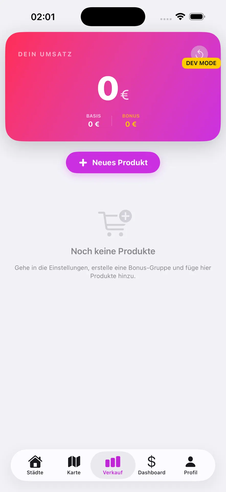
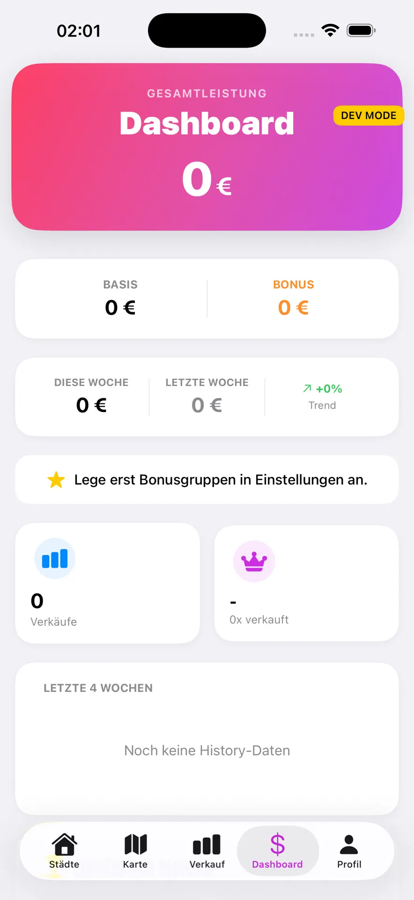

# TrackX — D2D Sales Manager (iOS)

> **📱 Live im Apple App Store** · Eigenständig entwickelt von Shahin Mir Jalili

---

**TrackX** ist eine native iOS-App für **Door-to-Door-Vertriebsteams**. Verkäufer organisieren
ihre Gebiete (Städte → Straßen → Hausnummern), tracken Verkäufe in Echtzeit, behalten Provisionen
im Blick und sehen ihre Routen auf der Karte. Vom Konzept über Design bis zum App-Store-Release
komplett selbst entwickelt.

## 📸 Screenshots

  
  
  
  

## ✨ Features

- **Gebiets-Management** — Städte, Straßen und Hausnummern hierarchisch verwalten, Fortschritt pro Gebiet
- **Karten-Tracking** — Gebiete und Leads auf der Karte (MapKit), Status-Filter (offen / interessiert / abgeschlossen)
- **Verkaufs-Counter** — Verkäufe mit einem Tap erfassen, Produkte & Bonus-Gruppen
- **Earnings-Dashboard** — Basis + Bonus, Wochen-Trend, persönliche Statistiken
- **OCR-Kamera** — Adressen automatisch aus Fotos erkennen
- **Team-Features (v1.3)** — Teams, Rollen, Chat und ein Web-Dashboard für Teamleiter
- **Premium-Abo** — Freemium-Modell über StoreKit 2

## 🛠️ Tech-Stack

| Bereich | Technologie |
|---------|-------------|
| Sprache | Swift 6 |
| UI | SwiftUI |
| Karten & Standort | MapKit, CoreLocation |
| Backend | Firebase (Auth + Firestore) |
| Payments | StoreKit 2 |
| Tooling | Xcode, CocoaPods |

## 👤 Meine Rolle

Solo-Entwickler — **gesamte Produktentwicklung**: Idee, UX/UI-Design, iOS-Entwicklung,
Firebase-Backend, In-App-Käufe, App-Store-Einreichung und laufende Updates (aktuell v1.3 in Arbeit).

## 🔒 Hinweis zum Quellcode

Dies ist ein **Showcase-Repository**. TrackX ist ein kommerzielles Produkt mit echten Nutzerdaten —
der Quellcode ist daher privat. Dieses Repo zeigt das Produkt, die Architektur und meinen Beitrag.
Gerne gebe ich im Gespräch tiefergehende Einblicke.

---

  <a href="https://apps.apple.com/de/app/trackx/id6757627264"><b>→ TrackX im App Store ansehen</b></a>

